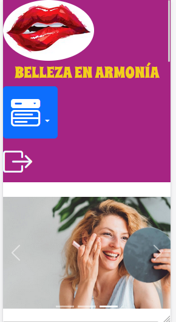

# Belleza en Armonía

Esta pagina es un taller de la clase de Reparación de Equipos 2, con el fin de practicar html y Git y GitHub.

## De esta forma se ve en pantalla de escritorio

## De esta forma se ve en pantalla de celular

## Instrucciones
1. Clonar el repositorio: `git clone https://github.com/Luzma11/Pagina-Belleza.git`
2. Abrir `index.html` en tu navegador favorito.

## Contacto
Para más información, puedes contactarme en [luz.arias@gmail.com](luz.arias@gmail.com).

